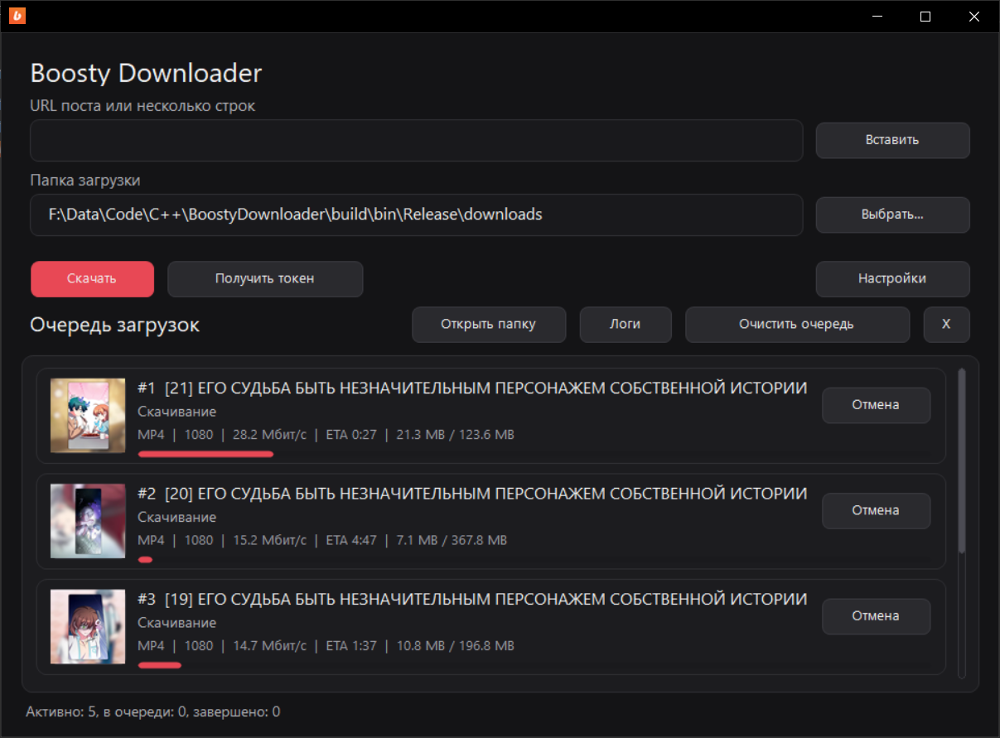
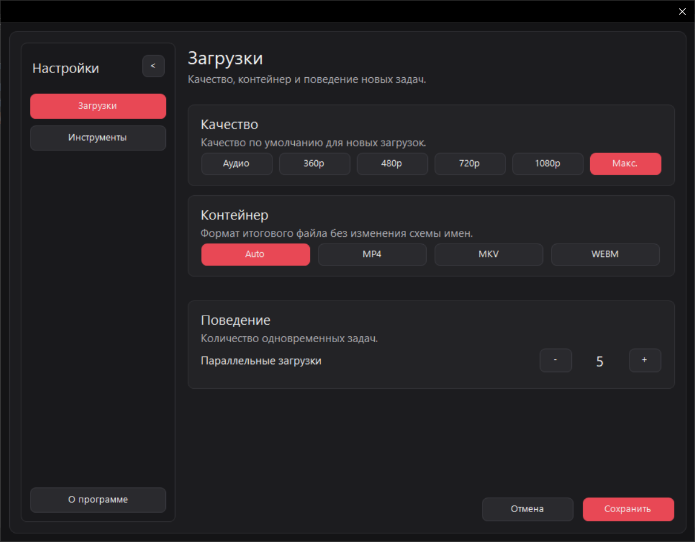
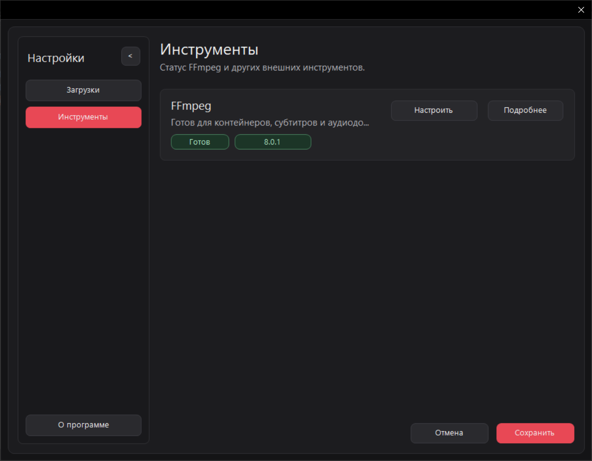

# BoostyDownloader

BoostyDownloader - портативное Win32-приложение для скачивания видео из доступных пользователю постов Boosty. Приложение работает без отдельной установки, хранит настройки рядом с исполняемым файлом и использует нативный Windows-интерфейс.

## Возможности

- скачивание видео по одной ссылке или по списку ссылок;
- очередь загрузок с прогрессом, скоростью, ETA, отменой, удалением и повторным запуском задач;
- выбор качества видео и контейнера по умолчанию;
- несколько параллельных загрузок;
- авторизация через встроенное окно WebView2 и сохранение Boosty-токена;
- выбор папки загрузки и открытие папки из приложения;
- автоматический поиск, выбор и установка FFmpeg;
- сохранение очереди и восстановление незавершенных задач после перезапуска;
- просмотр логов и проверка обновлений приложения.

## Скриншоты







## Использование

Для запуска Release-сборки x64 нужен актуальный пакет [Microsoft Visual C++ Redistributable x64](https://aka.ms/vc14/vc_redist.x64.exe). Если пакет ещё не установлен, установите его перед запуском приложения. Visual Studio для запуска готового EXE не требуется.

Для входа через встроенное окно также нужен [Microsoft Edge WebView2 Runtime](https://developer.microsoft.com/en-us/microsoft-edge/webview2/#download); если он отсутствует, установите Evergreen Runtime. WebView2 SDK нужен только для сборки.

1. Запустите `BoostyDownloader.exe`.
2. Нажмите `Получить токен`, войдите в Boosty и сохраните авторизацию.
3. Выберите папку загрузки.
4. Вставьте URL поста или несколько ссылок построчно.
5. Нажмите `Скачать`.

Если FFmpeg не найден, приложение предложит указать путь к нему или установить автоматически.

## Сборка

Требования:

- Windows;
- Build Tools for Visual Studio 2026 с MSVC x64/x86 и Windows SDK; IDE Visual Studio не обязательна;
- CMake 4.2 или новее для генератора Visual Studio 2026;
- WebView2 SDK, если он не подтягивается из локального окружения сборки.

Сконфигурировать и собрать release-версию:

```powershell
cmake -S . -B build -G "Visual Studio 18 2026" -A x64 -T v145
cmake --build build --config Release
```

Исполняемый файл будет лежать в `build/bin/Release/`.

Release-сборка x64 проверена с Build Tools 2026, MSVC 19.51 и Windows SDK 10.0.26100.0.

Если папка `build` настроена для другой версии Visual Studio, добавьте `--fresh` к команде конфигурации. Кэш CMake будет пересоздан, а остальные файлы в `build`, включая файлы рядом с EXE, сохранятся.

Запуск тестов:

```powershell
ctest --test-dir build -C Release --output-on-failure
```

## Технические детали

- C++20;
- нативный Win32 UI: GDI+, DWM, Common Controls;
- WinHTTP для HTTP-запросов и скачивания файлов;
- WebView2 для входа в Boosty и получения cookies;
- `nlohmann/json` single-header library в `third_party/`;
- MSVC из Build Tools for Visual Studio 2026 под Windows.

## Лицензия

Проект распространяется под лицензией MIT. Текст лицензии находится в файле [LICENSE](LICENSE).
